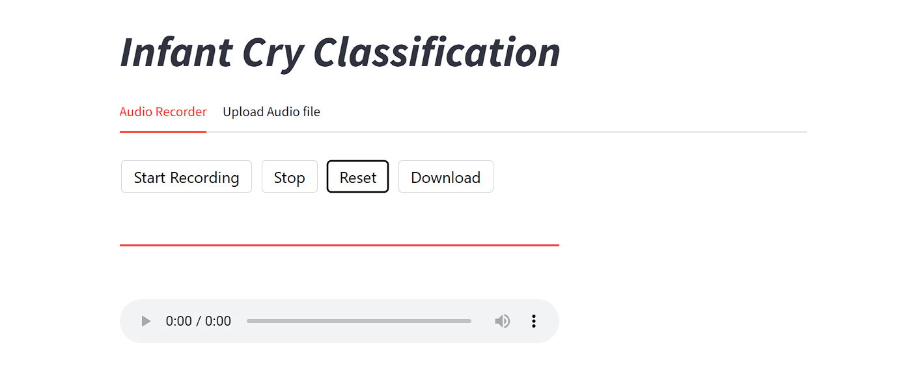

<!-- ABOUT THE PROJECT -->
## About The Project

Ever wonder what your baby’s cries really mean? This project classifies the sounds of baby cries into categories such as belly pain, burping, discomfort, hunger, and tiredness. Utilizing the [Infant Cry Audio Corpus dataset](https://www.kaggle.com/datasets/warcoder/infant-cry-audio-corpus), the model helps parents better understand their baby's needs.

Audio data is preprocessed using TensorFlow to squeeze audio dimensions and create spectrograms, which visually represent sound. The data is divided into training, validation, and test sets for efficient training. The model features convolutional layers for feature extraction, followed by fully connected layers for classification. Deployed with Streamlit, the application allows users to upload audio files or input live recordings in WAV format. Once processed, it displays the classification of the audio, assisting parents in decoding the meaning behind their baby’s cries.



This innovative tool aids in understanding a baby’s needs effectively!

### Built With

* [](https://www.python.org/)
* [](https://matplotlib.org/)
* [](https://numpy.org/)
* [](https://scikit-learn.org/stable/)
* [](https://www.tensorflow.org/)
* [](https://scipy.org/)


<!-- GETTING STARTED -->
## Getting Started

### Run Locally

1. Clone the repo
2. Install necessary packages
   ```sh
   pip install -r requirements.txt
   ```
4. Run streamlit_app.py 
   ```js
   streamlit run streamlit_app.py
   ```


<!-- DEMO -->
## Demo


